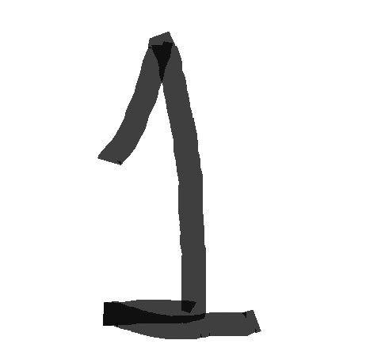
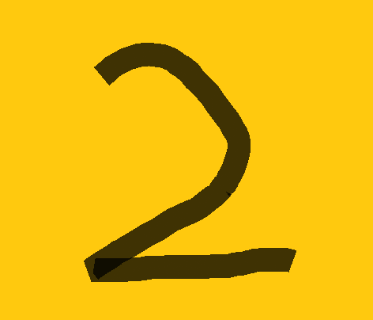
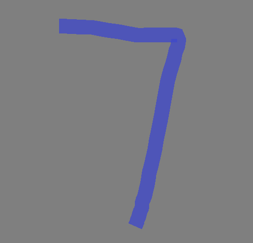

# CS5830-Assignment02
Task 1 and Task 2 have been done on same code file

## Performance of API model on custom inputs
All the images were generated using MS Paint. I tried to keep the inputs varying in size and colour to test the model's real-world performance.

| Sr No.    |  Digit (Image) | Actual Class | Predicted Class |
|---------|--------------|:-----------------:|:--------------------:|:----------------------:|
| 1       |    | 0  | 2    |
| 2       |    | 1  | 9    |
| 3       |    | 2  | 5    |
| 4       |    | 3  | 8    |
| 5       |    | 4  | 3    |
| 6       |    | 5  | 8    |
| 7       |    | 6  | 8    |
| 8       |    | 7  | 8    |
| 9       |     | 8  | 8    |
| 10       |   | 9  | 8    |

We observe that the model's performance is suboptimal. This issue can be attributed to the absence of image transformations during training. Additionally, the model encounters difficulties with varying input shapes, and almost no image exists in the original input size of (28,28).
